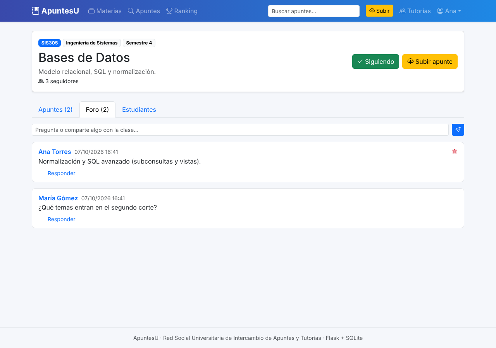

# ApuntesU · Red Social Universitaria de Intercambio de Apuntes y Tutorías

Aplicación web en **Python (Flask)** con base de datos **SQLite** donde los estudiantes suben material de
estudio por materias y otros pueden descargarlo, calificarlo, comentarlo o solicitar una tutoría
personalizada al creador.


## Funcionalidades

- **Cuentas de usuario**: registro, inicio de sesión (contraseñas cifradas) y perfil editable.
- **Materias**: crear, buscar y **seguir** materias (relación muchos a muchos estudiante ↔ materia).
- **Apuntes**: subir archivos (PDF, Word, PowerPoint, Excel, imágenes, ZIP, TXT, MD; máx. 20 MB) con
  título, tipo y etiquetas. Se guardan los **metadatos del archivo** (nombre, extensión, tipo MIME,
  tamaño, hash SHA-256, fecha) y se avisa si alguien sube un archivo duplicado.
- **Descargas** con historial y contador.
- **Calificaciones**: de 1 a 5 estrellas (una por estudiante y apunte, se puede cambiar) con distribución
  de votos, más botón de **me gusta**.
- **Foros de comentarios**: uno por cada apunte y uno por cada materia, con respuestas.
- **Tutorías**: solicitar una tutoría al autor de un apunte (tema, mensaje, fecha propuesta, modalidad);
  el tutor puede aceptar, rechazar o marcarla como completada, y el estudiante puede cancelarla.
- **Búsqueda** por texto, tipo y etiquetas; **ranking** de contribuidores por calificación promedio.
- **Inicio personalizado** con los apuntes nuevos de las materias que sigues.
- **Panel de administración** (`/admin`) para ver, buscar, editar, eliminar y exportar a CSV
  los datos de todas las tablas desde el navegador.

| Apunte con calificaciones y metadatos | Foro de la materia | Tutorías |
|---|---|---|
|  |  |  |

El modelo de base de datos (diagrama entidad-relación, relaciones muchos a muchos, restricciones y
consultas SQL de ejemplo) está explicado en **[docs/modelo_datos.md](docs/modelo_datos.md)**.

## Cómo ejecutarla (en cualquier computador)

Requisitos: **Python 3.10 o superior** y **Git**.

```bash
# 1. Descargar el proyecto desde GitHub
git clone https://github.com/SrSergio-S/red_social.git
cd red_social

# 2. Crear un entorno virtual
python -m venv venv
# Windows:
venv\Scripts\activate
# macOS / Linux:
source venv/bin/activate

# 3. Instalar dependencias
pip install -r requirements.txt

# 4. Crear la base de datos con datos de ejemplo
flask --app run seed

# 5. Iniciar la aplicación
flask --app run run
```

Abre **http://127.0.0.1:5000** en el navegador.

Usuarios de prueba (contraseña `demo123` para todos):

| Correo | Perfil |
|---|---|
| ana@uni.edu | **Administradora** (enlace *Admin* en el menú) · tiene una tutoría pendiente |
| luis@uni.edu | Ing. de Sistemas |
| maria@uni.edu | Ing. Industrial |
| carlos@uni.edu | Ing. de Sistemas |
| sofia@uni.edu | Matemáticas |

> Si no tienes Git, en GitHub usa **Code → Download ZIP**, descomprime y sigue desde el paso 2.
> Si la base de datos está vacía al arrancar, la app carga sola los datos de ejemplo
> (puedes desactivarlo con la variable de entorno `AUTO_SEED=0`).

### En GitHub Codespaces

1. En el repositorio: **Code → Codespaces → Create codespace on main**.
2. En la terminal del Codespace:
   ```bash
   pip install -r requirements.txt
   flask --app run run
   ```
3. Aparecerá un aviso de "puerto 5000 disponible": pulsa **Open in Browser**
   (o ve a la pestaña **Ports** y abre la dirección del puerto 5000).
4. Entra con `ana@uni.edu` / `demo123`.

Si ya tenías el Codespace abierto, para traer la última versión ejecuta
`git pull` y `pip install -r requirements.txt` antes de volver a iniciar la app.
> La app no necesita internet para verse bien: Bootstrap viene incluido en `app/static/vendor/`.

### Panel de administración

Entra con `ana@uni.edu` / `demo123` y pulsa **Admin** en el menú (o abre `/admin`). Desde ahí puedes:

- Editar cualquier registro (usuarios, materias, apuntes, etiquetas, calificaciones, comentarios, tutorías).
- Cambiar contraseñas (campo *Nueva contraseña* al editar un usuario) y dar o quitar permisos de administrador.
- Buscar, filtrar, editar rápido con un clic en los campos subrayados, borrar varios a la vez y exportar a CSV.

Solo entran los usuarios marcados como administradores. Para convertir a otro usuario en administrador:

```bash
flask --app run hacer-admin correo@ejemplo.com
```

### Comandos útiles

| Comando | Qué hace |
|---|---|
| `flask --app run seed` | Borra la base de datos y la llena con datos de ejemplo |
| `flask --app run reset-db` | Borra todos los datos (al volver a arrancar se cargan los de ejemplo, salvo con `AUTO_SEED=0`) |
| `flask --app run hacer-admin CORREO` | Da acceso al panel `/admin` a ese usuario |
| `flask --app run run --debug` | Inicia con recarga automática al editar código |
| `pytest` | Ejecuta las pruebas automáticas |

La base de datos se crea en `instance/red_social.db` y los archivos subidos en `instance/uploads/`.
Esa carpeta no se sube a GitHub (está en `.gitignore`); cada computador genera la suya con
`flask --app run seed`. Para ver las tablas puedes abrir el `.db` con
[DB Browser for SQLite](https://sqlitebrowser.org/).

## Estructura del proyecto

```
red_social/
├── run.py                 # Punto de entrada
├── requirements.txt       # Dependencias
├── app/
│   ├── __init__.py        # Crea la app, base de datos y login
│   ├── config.py          # Configuración (BD, carpeta de archivos, límites)
│   ├── models.py          # Tablas y relaciones (SQLAlchemy)
│   ├── auth.py            # Registro, login y logout
│   ├── main.py            # Materias, apuntes, calificaciones, likes, foros, perfiles, ranking
│   ├── tutorias.py        # Solicitudes de tutoría y sus estados
│   ├── admin.py           # Panel de administración (/admin)
│   ├── seed.py            # Comandos seed / reset-db y datos de ejemplo
│   ├── templates/         # Páginas HTML (Jinja2 + Bootstrap 5)
│   └── static/            # CSS y Bootstrap local
├── tests/test_app.py      # Pruebas automáticas
└── docs/                  # Modelo de datos y capturas
```

## Tecnologías

Flask 3 · Flask-SQLAlchemy (ORM) · Flask-Login (sesiones) · Flask-WTF (protección CSRF) ·
Flask-Admin (panel de administración) ·
SQLite · Bootstrap 5 · pytest.

Para usar otra base de datos (por ejemplo PostgreSQL o MySQL) basta con definir la variable de entorno
`DATABASE_URL` e instalar su driver; el código no cambia.
