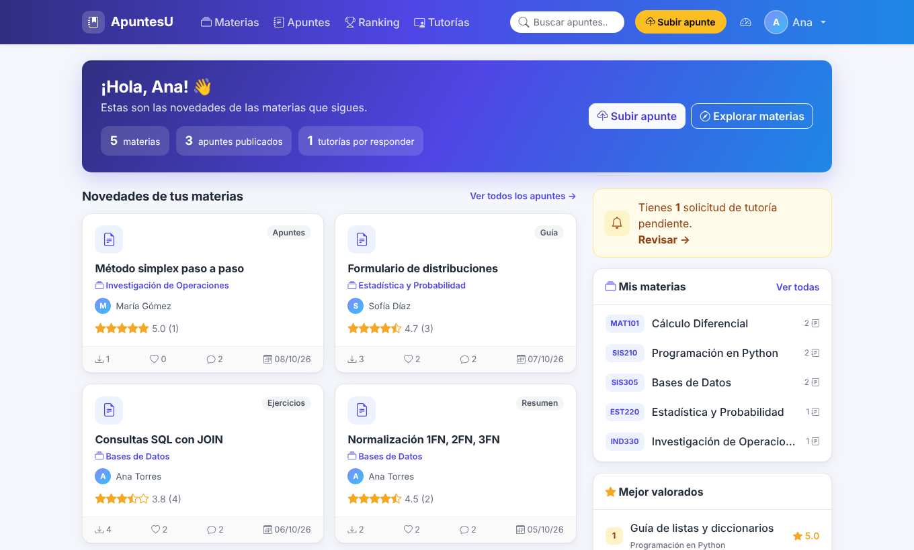
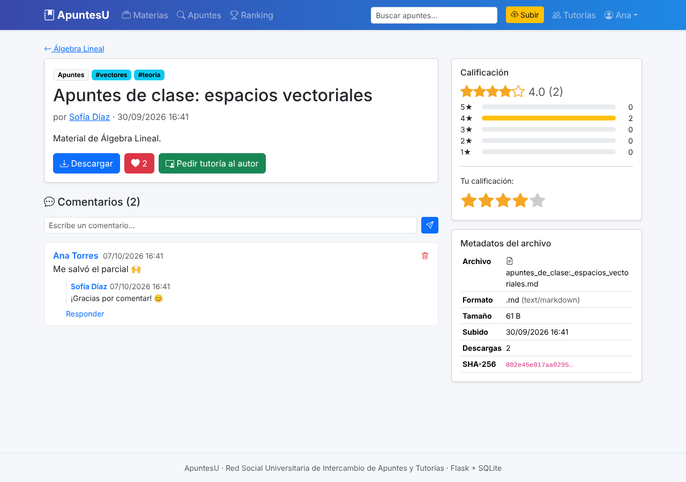
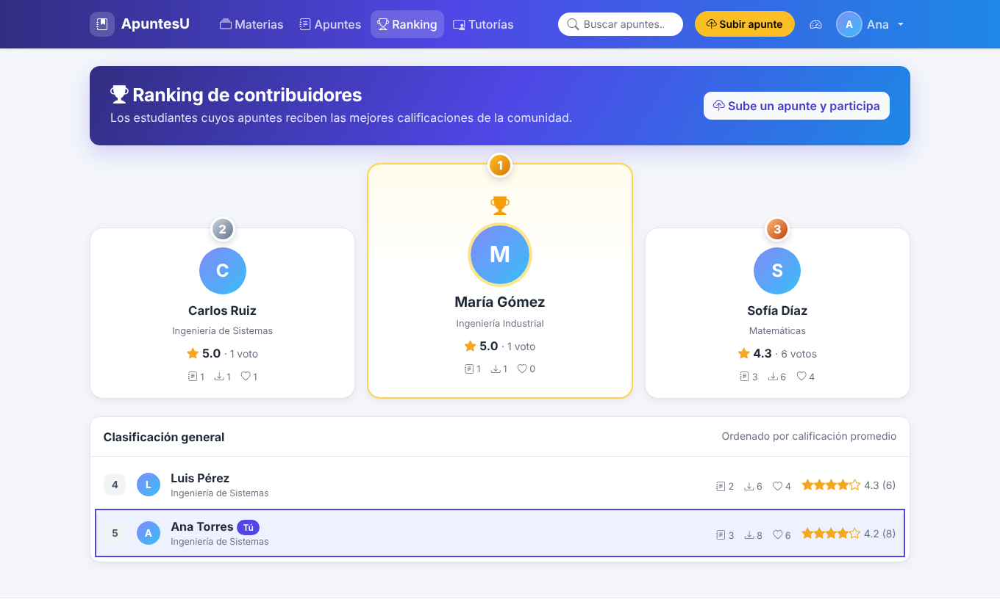
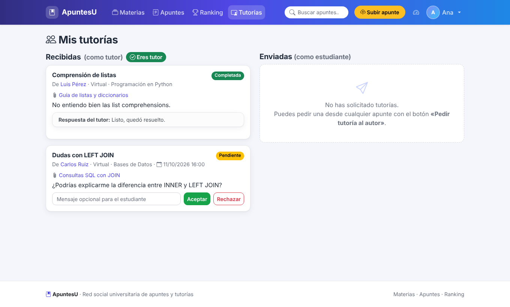
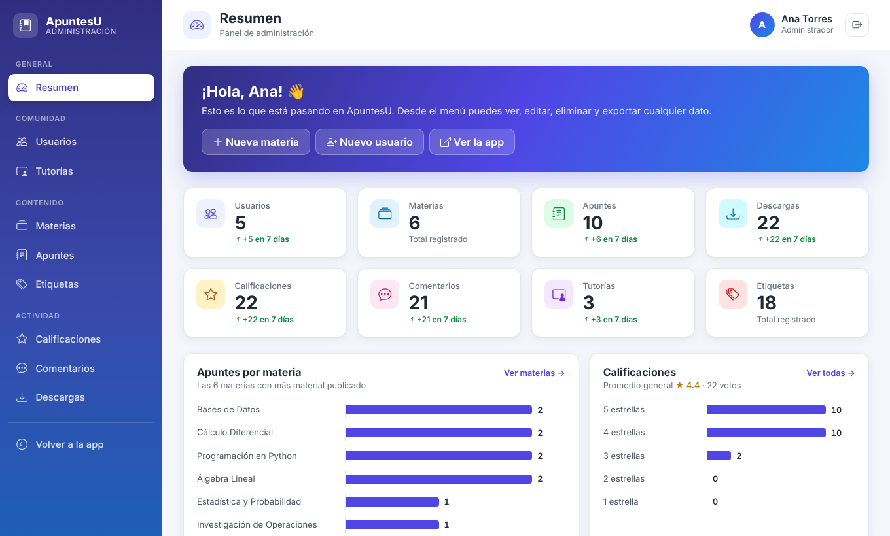

# ApuntesU · Red Social Universitaria de Intercambio de Apuntes y Tutorías

Aplicación web en **Python (Flask)** con base de datos **SQLite** en la que los estudiantes suben
material de estudio por materias y otros pueden descargarlo, calificarlo, comentarlo o solicitar una
tutoría personalizada al creador. Incluye un **panel de administración** para gestionar todos los datos
desde el navegador.



## Contenido

1. [Funcionalidades](#funcionalidades)
2. [Cómo ejecutarla](#cómo-ejecutarla)
3. [Cuentas para entrar](#cuentas-para-entrar)
4. [Panel de administración](#panel-de-administración)
5. [Llevar tus datos a otro computador](#llevar-tus-datos-a-otro-computador)
6. [Trabajar en el código](#trabajar-en-el-código)
7. [Comandos útiles](#comandos-útiles)
8. [Base de datos](#base-de-datos)
9. [Estructura del proyecto](#estructura-del-proyecto)
10. [Tecnologías](#tecnologías)
11. [Solución de problemas](#solución-de-problemas)

## Funcionalidades

### Para los estudiantes
- **Cuentas:** registro, inicio de sesión con contraseñas cifradas y perfil editable (carrera,
  semestre, "sobre mí" y si **ofrece tutorías**).
- **Inicio personalizado:** saludo con tu resumen (materias que sigues, apuntes publicados y tutorías por
  responder), los apuntes nuevos de tus materias, tus materias y el top 5 de mejor valorados.
- **Materias:** crear, buscar y **seguir** materias (relación muchos a muchos estudiante ↔ materia).
  Cada materia tiene sus apuntes (ordenables por recientes, mejor valorados o más descargados), un
  **foro** y la lista de estudiantes que la siguen.
- **Apuntes:** subir archivos (PDF, Word, PowerPoint, Excel, imágenes, ZIP, TXT y MD; máximo 20 MB) con
  título, tipo y etiquetas. Se guardan los **metadatos del archivo** (nombre, extensión, tipo MIME,
  tamaño, huella SHA-256 y fecha), y la app avisa si alguien sube un archivo repetido. Cada tarjeta
  muestra un icono con el color del tipo de archivo.
- **Descargas** con historial y contador.
- **Calificaciones** de 1 a 5 estrellas (una por estudiante y apunte, se puede cambiar), con la
  distribución de votos, y botón de **me gusta**.
- **Foros de comentarios** en cada apunte y en cada materia, con respuestas.
- **Tutorías:** desde un apunte o un perfil se pide una tutoría al autor (tema, mensaje, fecha propuesta
  y modalidad virtual o presencial). El tutor la acepta, la rechaza o la marca como completada, y el
  estudiante puede cancelarla. En **Mis tutorías** se ve si eres tutor; si no lo eres, la página lo
  indica y ofrece activarlo desde el perfil.
- **Búsqueda** por texto, tipo de material y etiquetas.
- **Ranking de contribuidores:** podio para los 3 primeros y lista para el resto, con calificación,
  número de votos, apuntes, descargas y me gusta de cada estudiante. Tu puesto aparece marcado con "Tú".
- **Diseño adaptable** a computador, tablet y celular, que funciona **sin internet** (Bootstrap y sus
  iconos vienen incluidos en el proyecto).

| Apunte con calificaciones y metadatos | Ranking | Mis tutorías |
|---|---|---|
|  |  |  |

### Para los administradores
- **Panel de administración** (`/admin`) con menú lateral, resumen con indicadores, gráficos y
  actividad reciente, y gestión completa de todas las tablas. Detalles en
  [Panel de administración](#panel-de-administración).

## Cómo ejecutarla

Requisitos: **Python 3.10 o superior** y **Git**.

### En tu computador

```bash
# 1. Descargar el proyecto
git clone https://github.com/SrSergio-S/red_social.git
cd red_social

# 2. Crear y activar un entorno virtual
python -m venv venv
venv\Scripts\activate            # Windows
source venv/bin/activate         # macOS / Linux

# 3. Instalar las dependencias
pip install -r requirements.txt

# 4. Iniciar la aplicación
python -m flask --app run run --debug
```

Abre **http://127.0.0.1:5000** en el navegador.

No hace falta crear la base de datos a mano: la primera vez que arranca, la app la crea y la llena con
los datos guardados en la carpeta `datos/` o, si esa carpeta no existe, con los datos de ejemplo.

> Si no tienes Git, en GitHub usa **Code → Download ZIP**, descomprime el archivo y sigue desde el paso 2.

### En GitHub Codespaces

1. En el repositorio: **Code → Codespaces → Create codespace on main**.
2. En la terminal del Codespace:
   ```bash
   pip install -r requirements.txt
   python -m flask --app run run --debug
   ```
3. Cuando aparezca el aviso del puerto 5000, pulsa **Open in Browser** (o abre la pestaña **Ports** y
   entra a la dirección del puerto 5000).

Para traer la última versión a un Codespace que ya tenías: detén la app con `Ctrl + C` y ejecuta
`git pull` y `pip install -r requirements.txt` antes de volver a iniciarla.

## Cuentas para entrar

El proyecto puede arrancar con dos conjuntos de datos:

- **Los datos del proyecto (carpeta `datos/`).** Es lo que carga un computador recién clonado. Entra con
  las cuentas que fueron registradas en la app; la cuenta administradora de esos datos puede ver todos
  los usuarios en `/admin` y cambiar cualquier contraseña.
- **Los datos de ejemplo.** Se cargan con `python -m flask --app run seed` (borra lo que haya en la base
  de datos de ese computador). Todas las cuentas usan la contraseña `demo123`:

  | Correo | Perfil |
  |---|---|
  | sergio@sanmateo.edu | **Administradora** (enlace *Admin* en el menú) · tiene una tutoría pendiente |
  | luis@sanmateo.edu | Ing. de Sistemas |
  | maria@sanmateo.edu | Ing. Industrial |
  | carlos@sanmateo.edu | Ing. de Sistemas |
  | sofia@sanmateo.edu | Matemáticas |
  | karen@sanmateo.edu | Ing. de Sistemas |

Para volver a los datos del proyecto después de usar los de ejemplo: `python -m flask --app run cargar-datos`.

## Panel de administración

Entra con una cuenta administradora y pulsa el icono de **Administración** en el menú (o abre `/admin`).



- **Resumen:**
  - indicadores de usuarios, materias, apuntes, descargas, calificaciones, comentarios, tutorías y
    etiquetas, con lo nuevo de los últimos 7 días;
  - gráficos de apuntes por materia y de distribución de calificaciones;
  - apuntes recientes, tutorías activas y últimos comentarios.
- **Menú por secciones:** *Comunidad* (usuarios, tutorías), *Contenido* (materias, apuntes, etiquetas) y
  *Actividad* (calificaciones, comentarios, descargas).
- En cada tabla puedes **buscar, filtrar, crear, editar, borrar** (uno o varios a la vez) y **exportar a
  CSV**. Los campos subrayados se editan con un clic directamente en la lista.
- **Usuarios:** cambiar contraseñas (campo *Nueva contraseña*), activar o quitar *Ofrece tutorías* y
  *Administrador*.
- Al borrar un apunte también se elimina su archivo. Los apuntes nuevos se suben desde la app (botón
  **Subir apunte**), porque necesitan un archivo.

Solo entran los administradores; cualquier otro usuario recibe "No tienes permiso". Para dar acceso a
otra persona, márcala como administradora en el panel o ejecuta:

```bash
python -m flask --app run hacer-admin correo@ejemplo.com
```

## Llevar tus datos a otro computador

La base de datos (`instance/`) no se sube a GitHub, pero puedes guardar sus datos dentro del proyecto.
Puedes hacerlo con la app funcionando, desde una **segunda terminal**:

```bash
python -m flask --app run guardar-datos --subir
```

Esto exporta todas las tablas a `datos/datos.json`, copia los archivos de los apuntes a
`datos/archivos/` y hace *commit* y *push* a GitHub. Sin `--subir` solo guarda la carpeta y tú haces el
commit.

- **Computador nuevo** (recién clonado): al iniciar la app se cargan solos los datos de `datos/`.
- **Computador donde ya usabas la app:** después de `git pull`, detén la app y ejecuta
  `python -m flask --app run cargar-datos` para reemplazar su base de datos por la de `datos/`.

> Los datos se sincronizan cuando tú lo pides, no en tiempo real. Guarda desde un solo lugar a la vez:
> si cambias datos en dos computadores, el último que ejecute `guardar-datos` reemplaza los del otro.
> Si el repositorio es público, cualquiera puede ver `datos/` (nombres, correos y comentarios; las
> contraseñas van cifradas).

## Trabajar en el código

- Inicia la app con `--debug`: al guardar un archivo `.py` se reinicia sola, y las plantillas HTML se
  actualizan al recargar la página. Si algo falla, el navegador muestra en qué línea está el error.
- Los cambios en estilos (`.css`) se ven al recargar con `Ctrl + F5`.
- Editar en el Codespace no actualiza GitHub. Sube tus cambios desde **Control de código fuente**
  (`Ctrl + Shift + G`) o con `git add -A`, `git commit -m "mensaje"` y `git push`.
- El código y los datos se suben por separado: `git push` sube el código y `guardar-datos --subir` los
  datos.

### Dónde cambiar el diseño

| Qué | Dónde |
|---|---|
| Colores y estilos de la app | `app/static/css/style.css` (colores principales en `:root`) |
| Colores y estilos del panel de administración | `app/static/css/admin.css` (colores en `:root`) |
| Barra de navegación y pie de página | `app/templates/base.html` |
| Tarjeta de apunte, estrellas, comentarios | `app/templates/_macros.html` |
| Estructura y resumen del panel | `app/templates/admin/mi_base.html` y `app/templates/admin/inicio.html` |
| Cada página | `app/templates/<sección>/...` |

## Comandos útiles

Si el comando `flask` no se reconoce, escribe `python -m flask` en su lugar (así están escritos aquí).

| Comando | Qué hace |
|---|---|
| `python -m flask --app run run --debug` | Inicia la app con recarga automática al editar el código |
| `python -m flask --app run guardar-datos [--subir]` | Guarda los datos actuales en `datos/` (y los sube a GitHub) |
| `python -m flask --app run cargar-datos` | Reemplaza la base de datos por la guardada en `datos/` |
| `python -m flask --app run seed` | Borra la base de datos y la llena con los datos de ejemplo |
| `python -m flask --app run reset-db` | Borra todos los datos (al volver a arrancar se cargan `datos/` o los de ejemplo, salvo con `AUTO_SEED=0`) |
| `python -m flask --app run hacer-admin CORREO` | Da acceso al panel `/admin` a ese usuario |
| `pytest` | Ejecuta las pruebas automáticas (15 pruebas) |

## Base de datos

- Se crea en `instance/red_social.db` y los archivos subidos se guardan en `instance/uploads/`. Esa
  carpeta no se sube a GitHub (está en `.gitignore`).
- Los cambios hechos en la app o en el panel se guardan **al instante** en la base de datos.
- Las bases de datos creadas con versiones anteriores se actualizan solas al arrancar (por ejemplo, se
  agrega la columna de administrador sin perder datos).
- Para ver las tablas fuera de la app: el panel `/admin`, la extensión **SQLite3 Editor** en
  VS Code/Codespaces, [DB Browser for SQLite](https://sqlitebrowser.org/) o `sqlite3 instance/red_social.db`.
- El modelo completo (diagrama entidad-relación, relaciones muchos a muchos, restricciones, estados de
  una tutoría y consultas SQL de ejemplo) está en **[docs/modelo_datos.md](docs/modelo_datos.md)**.

Relaciones principales:

| Relación | Tipo | Tabla |
|---|---|---|
| Estudiante ↔ Materia (seguir) | muchos a muchos | `seguimientos` |
| Estudiante ↔ Apunte (me gusta) | muchos a muchos | `likes` |
| Estudiante ↔ Apunte (calificar, 1 por persona) | muchos a muchos con datos | `calificaciones` |
| Estudiante ↔ Apunte (descargar) | muchos a muchos con datos | `descargas` |
| Apunte ↔ Etiqueta | muchos a muchos | `apunte_etiquetas` |
| Materia → Apuntes, Usuario → Apuntes | uno a muchos | `apuntes` |
| Comentario → Apunte **o** Materia, con respuestas | uno a muchos | `comentarios` |
| Solicitante → Tutor | uno a muchos (x2) | `solicitudes_tutoria` |

## Estructura del proyecto

```
red_social/
├── run.py                   # Punto de entrada
├── requirements.txt         # Dependencias
├── pytest.ini               # Configuración de las pruebas
├── app/
│   ├── __init__.py          # Crea la app, la base de datos, el login y actualiza BD antiguas
│   ├── config.py            # Configuración (BD, carpetas, límites, AUTO_SEED)
│   ├── models.py            # Tablas y relaciones (SQLAlchemy)
│   ├── auth.py              # Registro, login y logout
│   ├── main.py              # Materias, apuntes, calificaciones, likes, foros, perfiles y ranking
│   ├── tutorias.py          # Solicitudes de tutoría y sus estados
│   ├── admin.py             # Panel de administración (/admin)
│   ├── datos.py             # Comandos guardar-datos y cargar-datos
│   ├── seed.py              # Comandos seed, reset-db, hacer-admin y datos de ejemplo
│   ├── templates/           # Páginas HTML (Jinja2 + Bootstrap 5)
│   │   └── admin/           # Diseño propio del panel de administración
│   └── static/
│       ├── css/style.css    # Estilos de la app
│       ├── css/admin.css    # Estilos del panel de administración
│       └── vendor/          # Bootstrap e iconos incluidos (no editar)
├── datos/                   # Datos guardados con guardar-datos (datos.json + archivos/)
├── tests/test_app.py        # Pruebas automáticas
└── docs/                    # Modelo de datos y capturas de pantalla
```

## Tecnologías

Flask 3 · Flask-SQLAlchemy (ORM) · Flask-Login (sesiones) · Flask-WTF (protección CSRF) ·
Flask-Admin + Flask-Babel (panel de administración en español) · SQLite · Bootstrap 5 + Bootstrap Icons ·
pytest.

Para usar otra base de datos (por ejemplo PostgreSQL o MySQL) basta con definir la variable de entorno
`DATABASE_URL` e instalar su driver; el código no cambia.

## Solución de problemas

| Problema | Solución |
|---|---|
| `flask: command not found` | Usa `python -m flask ...` o activa el entorno virtual (`source venv/bin/activate`). |
| `No module named flask` (u otra librería) | Ejecuta `pip install -r requirements.txt`. |
| "Correo o contraseña incorrectos" con `ana@uni.edu` | Esa cuenta es de los datos de ejemplo: ejecuta `python -m flask --app run seed`, o entra con una cuenta de los datos del proyecto. |
| No veo los cambios después de `git pull` | Reinicia la app (`Ctrl + C` y vuelve a iniciarla) y recarga con `Ctrl + F5`. |
| No veo los datos que guardó otra persona | Después de `git pull`, detén la app y ejecuta `python -m flask --app run cargar-datos`. |
| Entro a `/admin` y dice "No tienes permiso" | Tu usuario no es administrador: `python -m flask --app run hacer-admin TU_CORREO`. |
