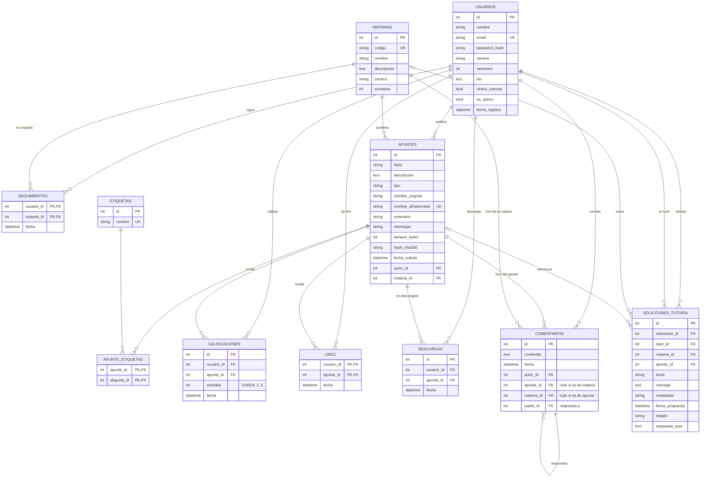
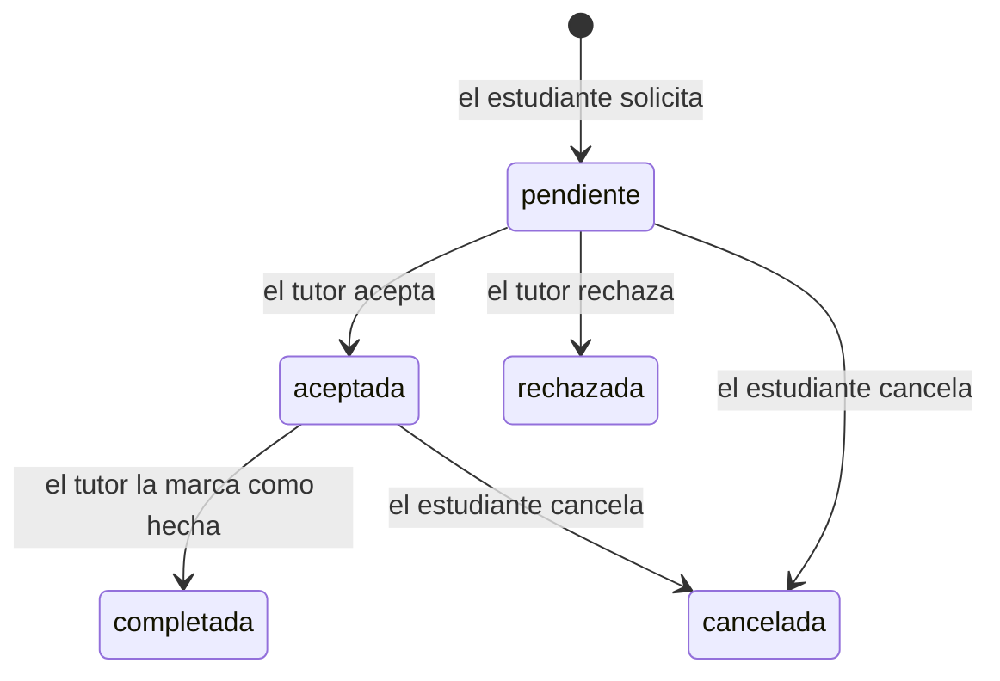

# Modelo de datos

Base de datos relacional (SQLite por defecto) definida con SQLAlchemy en [`app/models.py`](../app/models.py).
GitHub dibuja automáticamente el siguiente diagrama entidad-relación:



## Relaciones muchos a muchos

| Relación | Tabla intermedia | Datos extra en la relación |
|---|---|---|
| Un estudiante sigue muchas materias / una materia tiene muchos estudiantes | `seguimientos` | fecha en que empezó a seguirla |
| Un estudiante da "me gusta" a muchos apuntes / un apunte gusta a muchos | `likes` | fecha |
| Un estudiante califica muchos apuntes / un apunte recibe muchas calificaciones | `calificaciones` (modelo propio) | estrellas 1–5, fecha |
| Un estudiante descarga muchos apuntes / un apunte es descargado por muchos | `descargas` (modelo propio) | fecha (historial) |
| Un apunte tiene muchas etiquetas / una etiqueta está en muchos apuntes | `apunte_etiquetas` | — |

## Reglas de integridad en la base de datos

- **`UNIQUE (usuario_id, apunte_id)`** en `calificaciones`: un estudiante solo puede calificar una vez cada apunte (si vuelve a calificar, se actualiza).
- **`CHECK (estrellas BETWEEN 1 AND 5)`** en `calificaciones`.
- **`CHECK`** en `comentarios`: cada comentario pertenece a un apunte **o** a una materia, nunca a ambos ni a ninguno.
- **`ON DELETE CASCADE`**: al borrar un apunte se borran sus calificaciones, likes, descargas y comentarios (en SQLite se activa con `PRAGMA foreign_keys=ON`, ver `app/__init__.py`).
- La clave primaria compuesta de `seguimientos` y `likes` impide seguir dos veces la misma materia o dar dos likes al mismo apunte.

## Metadatos de archivos

El archivo físico se guarda en `instance/uploads/` con un nombre aleatorio (UUID) para evitar choques y
nombres peligrosos. En la tabla `apuntes` se almacena: nombre original, nombre almacenado, extensión,
tipo MIME, tamaño en bytes y hash **SHA-256** del contenido (sirve para detectar archivos duplicados).

## Estados de una tutoría



## Consultas SQL de ejemplo

```sql
-- Promedio de estrellas y número de descargas por apunte
SELECT a.titulo,
       ROUND(AVG(c.estrellas), 1)              AS promedio,
       (SELECT COUNT(*) FROM descargas d WHERE d.apunte_id = a.id) AS descargas
FROM apuntes a
LEFT JOIN calificaciones c ON c.apunte_id = a.id
GROUP BY a.id
ORDER BY promedio DESC;

-- Materias con más seguidores
SELECT m.nombre, COUNT(s.usuario_id) AS seguidores
FROM materias m
LEFT JOIN seguimientos s ON s.materia_id = m.id
GROUP BY m.id
ORDER BY seguidores DESC;

-- Estudiantes que siguen "Bases de Datos"
SELECT u.nombre
FROM usuarios u
JOIN seguimientos s ON s.usuario_id = u.id
JOIN materias m ON m.id = s.materia_id
WHERE m.codigo = 'SIS305';
```
